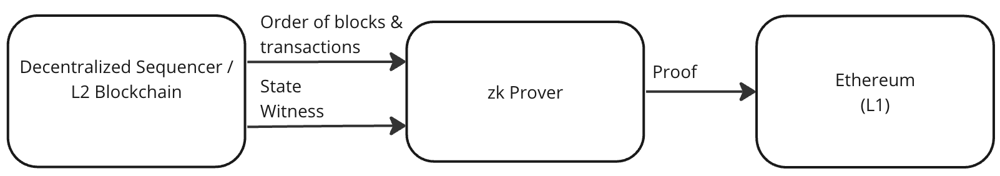

## Abstract

This EIP defines the interface that allows stateless zero knowledge provers to collect state information from blockchain nodes that are operating as decentralized sequencers.


## Motivation

Decentralized sequencers for zero knowledge rollups can be implemented as a blockchain. This blockchain 
holds state, and via a consensus protocol, allows nodes to come to agreement on the order of blocks. Provers can operate statelessly, fetch finalised blocks of transactions and state from the blockchain nodes. The proofs generated by the provers can then be verified on Ethereum. This type of rollup system is shown in the figure below.



This specification defines:

* Inilialisation configuration.
* Interface.


## Specification

The key words "MUST", "MUST NOT", "REQUIRED", "SHALL", "SHALL NOT", "SHOULD", "SHOULD NOT", "RECOMMENDED", "NOT RECOMMENDED", "MAY", and "OPTIONAL" in this document are to be interpreted as described in RFC 2119 and RFC 8174.

### Initialisation

TODO Things to be defined:

* Chain Id
* Address of Validator Set contract
* Storage slot of validator set map in Validator Set contract.
* Storage slot of the total number of validators in the Validator Set contract.
* Address of L2 to L1 bridge contract.
* Storage slot of WithdrawTrieRoot in L2 to L1 bridge contract.
* Validator signing configuration: 
  * ECDSA secp256k1 with KECCAK256
  * Aggregated BLS 12-381 with KECCAK256
* Storage proof format. 
  * Merkle Patricia Trie.

### Validator Contract

The information stored in the validator contract depends on the validator signing configuration.

#### ECDSA secp256k1 with KECCAK256

Validators are stored in a mapping and the total number of validators is stored as a uint256 as shown below.

```solidity
mapping (address => uint256) validatorStakes;
uint256 numValidators;
```

Validators are deemed to be active if the uint256 value for a validatorStakes's address is non-zero.

The storage slot specified in the initialisation is where the ```validatorStakes``` variable appears in the storage map. The storage slot for a validator's entry in the mapping can be calculated by calculating the equation shown below.

```
Validator Storage Slot = Keccak256(Storage Slot of Mapping, Address of Validator)
```


#### BLS 12-381 with KECCAK256

Validators are stored in a mapping and the total number of validators is stored as a uint256 as shown below.

```solidity
struct ValidatorInfo {
  uint256 validatorStake
  bytes publicKey;
}

mapping (bytes32 => uint256) validators;
uint256 numValidators;
```

Validators are identified by an identifier. This identifier could be the keccak256 of the validator's public key.

Validators are deemed to be active if the validatorStake value for a validator is non-zero.

The storage slot specified in the initialisation is where the ```validators``` variable appears in the storage map. The storage slot for a validator's stake in the mapping can be calculated by calculating the equation shown below.

```
Validator Stake Slot = Keccak256(Storage Slot of Mapping, Validator Identifier)
```

The storage slot for a validator's public key in the mapping can be calculated by calculating the equation shown below.

```
Validator Public Key Slot = Keccak256(Storage Slot of Mapping, Validator Identifier) + 1
```


### L2 to L1 Bridge Contract

This section defines the requirements related to the L2 to L1 bridge contract.

TODO


### JSON RPC APIs

#### Data Types

##### BlockInformationType

The following table describes the information contained in the ```BlockInformationType```.

<table>
<thead>
<tr>
  <th>Field</th>
  <th>Type</th>
  <th>Description</th>
</tr>
</thead>
<tbody>
<tr>
  <td>Chain Id</td>
  <td>Hex string</td>
  <td>Chain id of rollup.</td>
</tr>
<tr>
  <td>Block Header</td>
  <td>BlockHeaderType</td>
  <td>Block header of block being proven.</td>
</tr>
<tr>
  <td>Transactions</td>
  <td>Array of TransactionType</td>
  <td>Transactions that executed in the block being proven.</td>
</tr>
<tr>
  <td rowspan=4>Final Block Storage</td>
  <td rowspan=4>Array of StorageType</td>
  <td>Array of storage information after the last transaction in the block. This storage information includes the storage slots for:
      <tr><td>WithdrawaTrieRoot for the L2 to L1 bridge.</td></tr>
      <tr><td>Each validator that signed the block header.</td></tr>
      <tr><td>Total number of validators.</td></tr>
  </td>
</tr>
<tr>
  <td>TxStorageTraces</td>
  <td>Array of StorageTraceType</td>
  <td>Array of storage information for the start of each transaction.</td>
</tr>
<tr>
  <td>ExecutionResults</td>
  <td>Array of ExecutionResultType</td>
  <td>One execution result for each transaction in the block.</td>
</tr>
<tr>
  <td>StartL1QueueIndex</td>
  <td>Hex string</td>
  <td>Index into the L1 bridge queue at the end of the block.</td>
</tr>
</tbody>
</table>


##### BlockHeaderType

The following table describes the information contained in the ```BlockHeaderType```.

TODO

##### TransactionType

The following table describes the information contained in the ```TransactionType```.

TODO

##### StorageType

The following table describes the information contained in the ```StorageType```.

TODO

##### StorageTraceType

The following table describes the information contained in the ```StorageTraceType```.

TODO


##### ExecutionResultType

The following table describes the information contained in the ```ExecutionResultType```.

TODO


#### getBlockTraceByNumber

*Parameters*: 

* Block number: Hex string.

*Returns*:

* Block information: BlockInformationType.


#### getBlockTraceByHash

*Parameters*: 

* Block hash: Hex string.

*Returns*:

* Block information: BlockInformationType.


## Rationale

This section explains the rationale behind design decisions contained in this specification.


### Validator Contract

Having a validator contract that defines which entities can approve blocks is useful for the following reasons:

* Proving of validator changes is done as part of transaction proving. That is, when validators are controlled by a contract, transactions are used to add or remove validators. Provers then prove the transactions related to validator changes in the same way as they prove any other transaction. 
* Arbitrary logic can be applied used for adding or removing validators. That is, the validator contract can support any logic for controlling validators. From a proving system perspective, the only thing that needs to be defined is the list of approved validators.


### Block Information data structure

The following sections explain why each piece of information is required in the Block Information data structure.

#### Chain Id

The ```Chain Id``` is required to ensure the block information is not mistakenly replayed for a different rollup.

#### Block Header

The ```Block Header``` includes information required to prove consensus.


TODO: Explain the rationale for each piece of data being returned.

## Backwards Compatibility

No backward compatibility issues found.

## Test Cases

None.

## Reference Implementation

None.


## Security Considerations

The following security implications should be considered:

* Provers should only request blocks from decentralised sequencer blockchain nodes that are final. That is, proofs should only be generated and posted to Ethereum that represent finalised blocks from the decentralised sequencer.
* Provers implicitly trust the decentralised sequencer blockchain. Decentralised sequencer blockchain nodes could collude to generate a fork of the canonical blockchain. They could deliver state to the provers based on the fork. This specification assumes that decentralised sequencer blockchain nodes will not collude.
* The consensus protocol used by the decentralised sequencer blockchain nodes should be Byzantine Fault Tolerant. That is, it should be able to handle some faulty or malicious nodes. In this way, the prover will receive the correct state, not matter which node it communicates with, even if some of the nodes in the decentralised sequencer blockchain are malicious.

## Copyright

Copyright and related rights waived via [CC0](../LICENSE.md).
