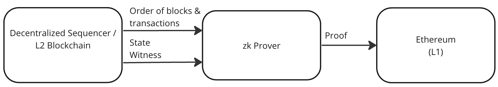

## Abstract

This EIP defines the bridging parts of the interface that allows stateless zero knowledge provers to collect state information from blockchain nodes that are operating as decentralized sequencers. This EIP is designed to be used in conjunction with , which defines the main interface between provers and sequencers, and , which defines a minimal set of properties for proving consensus.


## Motivation

Decentralized sequencers for zero knowledge rollups can be implemented as a blockchain. This blockchain holds state, and via a consensus protocol, allows nodes to come to agreement on the order of blocks. Provers can operate statelessly, fetch finalised blocks of transactions and state from the blockchain nodes. The proofs generated by the provers can then be verified on Ethereum. This type of rollup system is shown in the figure below.



This specification defines values to facilitate an L2 to L1 bridge. The bridge design is not dictated by this specification. Instead this specification specifies a minimal set of storage slots that need to be proven for each block. 

This specification defines:

* System configuration parameters.
* Storage slots whose values need to be proven at the end of each block.
* Required features of an arbitrary message bridge smart contract.


## Specification

The key words "MUST", "MUST NOT", "REQUIRED", "SHALL", "SHALL NOT", "SHOULD", "SHOULD NOT", "RECOMMENDED", "NOT RECOMMENDED", "MAY", and "OPTIONAL" in this document are to be interpreted as described in RFC 2119 and RFC 8174.

### Initialisation

TODO Things to be defined:

* Address of L2 to L1 bridge contract.
* Storage slot of WithdrawTreeRoot in the L2 to L1 bridge contract.


### Final Block Storage to be Proven

The following storage slots need to be proven as part of the Final Block Storage section of the BlockInformationType defined in EIP-75XXa:

* WithdrawalTreeRoot for the L2 to L1 arbitrary message bridge.


### L2 to L1 Bridge Contract

This section defines the requirements related to the L2 to L1 bridge contract.

All rollups MUST have an L2 to L1 arbitrary message bridge contract. The contract MUST contain a storage value ```l2L1WithdrawalTreeRoot```, that summarises the messages that have been communicated between L2 and L1.

```solidity
bytes32 l2L1WithdrawalTreeRoot;
```

## Rationale

This section explains the rationale behind design decisions contained in this specification.

#### L2 to L1 Bridge Contract

The ```l2L1WithdrawalTreeRoot``` is the only storage value defined for the L2 to L1 bridge. This is the root of a Sparse Merkle Tree of all crosschain messages that have been processed on L2. When this value is available via the proof on L1, users will be able to submit exit transactions based on this Merkle Tree Root value. 


## Backwards Compatibility

No backward compatibility issues found.

## Test Cases

None.

## Reference Implementation

None.


## Security Considerations

The following security implications should be considered:

* TODO

## Copyright

Copyright and related rights waived via [CC0](../LICENSE.md).
